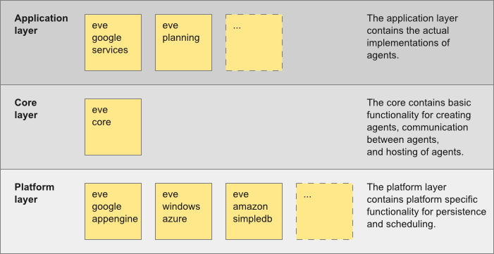

# Overview

MemoNodes has libraries available for Java. The MemoNodes libraries can be added to an existing Java project, 
and require almost no configuration (see [this tutorial](gettingstarted.html)).
Agents are regular Java classes decorated with some annotations. 
The agents are hosted via a regular web servlet.

## Libraries {#libraries}

The Java libraries are spread over the following different layers:

- **Core Layer**  
  There is one core library, named *memonodes-core.jar*. This is the basis of MemoNodes, 
  and is always required in any application that uses or extends MemoNodes data store.
  It contains abstract base classes for graph elements, operations and in-memory data persistency, 
  and contains one ready-made servlet to store, query and interact programatically with the data. 
  The core is independent from the deployment platform.

- **Data Persistence Layer**  
  The data data persistence layer contains platform specific functionality for data persistence. 
  It offers an interface to applications for reading/writing data. 
  Currently, there are platform libraries for a regular java web application, for running
  as Google App Engine application in the cloud hosted by Google. In the future, libraries for 
  the clouds hosted by Microsoft (Windows Azzure) and Amazon (EC2) will be added.
  To deploy an application on a another platform, all is needed is to swap 
  the used platform library.

- **Application Layer**  
  The application layer contains the actual implementation of the application handling data objects and intearacting with the MemoNodes memory.
  MemoNodes will come with libraries containing tasks such as cleaning, filtering, displaying, adding, sorting, searching, etc of objects in the memory. 
  

The image below shows a schematic overview of the layers and libraries. 

*Remark: Only the libraries memonodes-core and memonodes-gae can be downloaded at this time. More libraries will follow soon.*

The Java libraries can be downloaded at 
[https://github.com/almende/MemoNodes/tree/master/java/bin](https://github.com/almende/MemoNodes/tree/master/java/bin).

## Servlets {#servlets}

In Java, each individual memory is hosted via a web servlet. 
MemoNodes comes with two ready-made servlets: an MemoNodesServlet (in-memory) and a GAEServlet (Google App Engine data store).
These servlets are located in the memonodes-core.jar and memonodes-gae.jar library, respectively. 
Furthermore, one can create his/her own custom servlet when needed.
